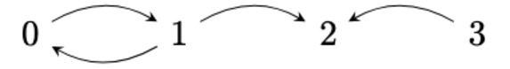

<style>
body {
    font-size: 42px;
}
</style>

{#title}
# Polymorphic bottom-up weighted relational programming

{#authors}
{style="text-align:center"}
### Dmitri Volkov, Yafei Yang, Chung-Chieh Shan

{style="text-align:center"}
### Indiana University

<br />

{style="text-align:center"}
{#repo-link}
> [https://github.com/sporkl/semiringkanren](https://github.com/sporkl/semiringkanren)

<br />

{#title-anchor}
<br />

<br /> <br /> <br /> <br /> <br />

{slip}
{pause}
-----
## Introducing *semiringKanren*:

semiringKanren is a *relational programming language*.

{pause}
Relations take values, and either *succeed* or *fail* for those values. semiringKanren computes success/failure for all possible values.

{pause}
Relations are defined in terms of *primitive relations* and *connectives*. Collectively, we call these *goals*.

{pause}
{up}
{.example title="Transitive closure"}
{#ex-transitive-closure}
---

Given the graph:



We can express connectivity (or "transitive closure") as a recursive relation:

```
(defrel (connect (x : (Num 4)) (y : (Num 4)))
  (disj
    (graph x y)
    (fresh ((z : (Num 4)))
      (conj
        (connect x z)
        (connect z y)))))
```
{pause}
{down="ex-transitive-closure"}

In semiringKanren, relations demote multidimensional arrays. These arrays can essentially be thought of as truth tables.


{style="float:right"}

```math
\begin{matrix}
    & & \begin{matrix} & y & \rightarrow & \end{matrix} \\ 
    & & \begin{matrix} 0 & 1 & 2 & 3 \end{matrix} \\
    \begin{matrix} x \\ \downarrow \\ \end{matrix} &
    \begin{matrix} 0 \\ 1 \\ 2 \\ 3 \end{matrix} &
    \begin{bmatrix}
        1 & 1 & 1 & 0 \\
        1 & 1 & 1 & 0 \\
        0 & 0 & 0 & 0 \\
        0 & 0 & 1 & 0
    \end{bmatrix}
\end{matrix}
```
---

{pause}
{center}
In semiringKanren variables are *typed*. We notate "`x` has type `A`" as `x : A`.

Types can be thought of as denoting vector spaces, and values as denoting one-hot vectors.

{pause}
The `Unit` type has one value constructor, `sole`, which denotes $\begin{bmatrix} 1 \end{bmatrix}$.

{pause}
{center}
The `(Sum A B)` type is recursively defined from other types, and has two constructors.

- `(left x)`, which denotes $x \oplus \begin{bmatrix} 0 \stackrel{|B|}{\dots} \end{bmatrix}$
- `(right y)`, which denotes $\begin{bmatrix} 0 \stackrel{|A|}{\dots} \end{bmatrix} \oplus y$

For example, `(right sole) : (Sum (Num 2) Unit)` denotes $\begin{bmatrix} 0 & 0 & 1 \end{bmatrix}$.

$|A|$ denotes the size of the type, or how many values inhabit the type.

{pause}
`(Num n)` is shorthand for a recursively constructed sum type of size $n$.

{pause}
{down}
(semiringKanren also has product types, which denote $\otimes$)

<br />
<br />

{pause}
{up}
semiringKanren programs are *weighted*.

`(factor w)` adds weight to a program branch, where `w` is drawn from a *commutative semiring*.

{pause}

{#semirings}
{.definition title="Semirings"}
---
A *semiring* (or *rig*) is a set $R$ with $+$ and $*$ operations, with corresponding identity elements $0$ and $1$, such that:

```math
a * (b + c) = (a * b) + (b * c)
```

(and some additional properties).

Examples: real numbers with addition and multiplication, booleans with $\vee$ and $\wedge$.
 
---

Nonzero weights are treated as successes, and zero is treated as failure.

<br />

{pause}
{up}

Recursive relations are calculated by fixpoint!

{.example title="Min-tropical transitive closure"}
{#min-tropical-transitive-closure}
---

Recall transitive closure example with $(\mathbb{R}^\infty,\min,+)$: []{style="float:right"}

```
(defrel (connect (x : Num) (y : Num))
  (disj
    (graph x y)
    (fresh ((z : Num))
      (conj
        (connect x z)
        (connect z y)))))
```

Assume edges in the graph relation are given weight 1 by `(factor 1)`.

{pause}
{center}
First assume nothing: []{style="float:right"}
<br /><br />

```math
\begin{matrix}
    & & \begin{matrix} & y & \rightarrow & \end{matrix} \\
    & & \begin{matrix} 0 & 1 & 2 & 3 \end{matrix} \\
    \begin{matrix} x \\ \downarrow \\ \end{matrix} &
    \begin{matrix} 0 \\ 1 \\ 2 \\ 3 \end{matrix} &
    \begin{bmatrix}
    \infty & \infty & \infty & \infty \\
    \infty & \infty & \infty & \infty \\
    \infty & \infty & \infty & \infty \\
    \infty & \infty & \infty & \infty \\
    \end{bmatrix}
\end{matrix}
```

{pause}
{center}
`connect` calls fail, but `graph` calls do not:
```math
\begin{matrix}
    & & \begin{matrix} & y & \rightarrow & \end{matrix} \\
    & & \begin{matrix} 0 & 1 & 2 & 3 \end{matrix} \\
    \begin{matrix} x \\ \downarrow \\ \end{matrix} &
    \begin{matrix} 0 \\ 1 \\ 2 \\ 3 \end{matrix} &
    \begin{bmatrix}
    \infty & 1 & \infty & \infty \\
    1 & \infty & 1 & \infty \\
    \infty & \infty & \infty & \infty \\
    \infty & \infty & 1 & \infty \\
    \end{bmatrix}
\end{matrix}
```

{pause}
{down="min-tropical-transitive-closure"}
Now we can consider intermediate vertices:
```math
\begin{matrix}
    & & \begin{matrix} & y & \rightarrow & \end{matrix} \\
    & & \begin{matrix} 0 & 1 & 2 & 3 \end{matrix} \\
    \begin{matrix} x \\ \downarrow \\ \end{matrix} &
    \begin{matrix} 0 \\ 1 \\ 2 \\ 3 \end{matrix} &
    \begin{bmatrix}
    2 & 1 & 2 & \infty \\
    1 & 2 & 1 & \infty \\
    \infty & \infty & \infty & \infty \\
    \infty & \infty & 1 & \infty \\
    \end{bmatrix}
\end{matrix}
```

Re-evaluating `connect` gets the same result. All done! <br/> []{style="float:right"}
This gives minimum distances between nodes.

---

{pause}
{down}
> This is "bottom-up evaluation", similar to Datalog.
>
> Note we can approximate nonterminating recursions by computing the fixpoint up to bounded precision.
> <br /> <br />

{pause}
{up}
Goals in semiringKanren are either primitive relations, or connectives of other goals.

Primitive relations, like "normal" relations, denote multidimensional arrays. <br />
Connectives denote semiring operations on the arrays.

{pause}

Primitive relations: `==`, `=/=`. `factor`, and relation calls.

[`(== x y)`]{style="float:left"}
```math
\begin{bmatrix}
1 & 0 & 0 \\
0 & \ddots & 0 \\
0 & 0 & 1
\end{bmatrix}
```

{pause}

[`(=/= x y)`]{style="float:left"}
```math
\begin{bmatrix}
0 & 1 & 1 \\
1 & \ddots & 1 \\
1 & 1 & 0
\end{bmatrix}
```

{pause}
{center}
[`(factor 120)`]{style="float:left"}
```math
\begin{bmatrix}
120 & 120 & 120 \\
120 & \ddots & 120 \\
120 & 120 & 120
\end{bmatrix}
```

{pause}
{center}
{#goal-combinators-2}
Connectives: `conj`, `disj`, `fresh`.

{pause}
{up="goal-combinators-2"}

`conj` uses semiring multiplication:

```math
(\text{conj}\;
\begin{bmatrix}
2 & 2 & 2 \\
1 & 1 & 1 \\
0 & 0 & 0
\end{bmatrix}
\;
\begin{bmatrix}
0 & 1 & 2 \\
0 & 1 & 2 \\
0 & 1 & 2
\end{bmatrix})
\leadsto
\begin{bmatrix}
0 & 2 & 4 \\
0 & 1 & 2 \\
0 & 0 & 0
\end{bmatrix}
```

{pause}

`disj` uses semiring addition:
```math
(\text{disj}\;
\begin{bmatrix}
2 & 2 & 2 \\
1 & 1 & 1 \\
0 & 0 & 0
\end{bmatrix}
\;
\begin{bmatrix}
0 & 1 & 2 \\
0 & 1 & 2 \\
0 & 1 & 2
\end{bmatrix})
\leadsto
\begin{bmatrix}
2 & 3 & 4 \\
1 & 2 & 3 \\
0 & 1 & 2
\end{bmatrix}
```

{pause}
`fresh` uses summation:
```math
(\text{fresh}\;((x:\dots))\;
\begin{bmatrix}
0 & 1 & 2 \\
0 & 1 & 2 \\
0 & 1 & 2
\end{bmatrix})
\leadsto
\begin{bmatrix}
0 & 3 & 6
\end{bmatrix}
```

<br />
<br />

{slip}
{pause}
-----

## Polymorphic semiringKanren

semiringKanren supports *polymorphic relations*; relations which take in values of unknown types (represented with *type variables*).

{pause}
{up}
{#ex-sum-swap}
{.example title="Sum swap"}
---
```
(defrel (sum-swap (x : (Sum α Β)) (y : (Sum β α)))
  (disj
    (fresh ((a : α))
      (conj
        (== x (left a))
        (== y (right a))))
    (fresh ((b : β))
      (conj
        (== x (right b))
        (== y (left b))))))
```

{pause}
How can we denote `sum-swap` when we don't know how big `α` or `β` are?

{pause}
{center}
`sum-swap` gets denoted as:

```math
\begin{bmatrix}
0 & 0 & 0 & 1 & 0 & 0 \\
0 & 0 & 0 & 0 & 1 & 0 \\
0 & 0 & 0 & 0 & 0 & 1 \\
1 & 0 & 0 & 0 & 0 & 0 \\
0 & 1 & 0 & 0 & 0 & 0 \\
0 & 0 & 1 & 0 & 0 & 0
\end{bmatrix}
```
---

{pause}
{center}

Would we expect `(sum-swap (left 0) (right 1))` to succeed or fail? <br />
(with `α = (Num 2)`, `β = (Num 3)`) 

{pause}
What about `(sum-swap (left 0) (left 0))`?<br />
{pause}
Or `(sum-swap (left 0) (right 0))`?

{pause}
{up}
What is the denotation of this relation?

{#specific-sum-swap}
---
{style="float:left"}
```
(defrel (specific-sum-swap
  (x : (Sum (Num 2) (Num 3)))
  (y : (Sum (Num 3) (Num 2))))
  (sum-swap x y))
```

{style="float:right"}
$\begin{bmatrix} 0 & 0 & 0 & 1 & 0 & 0 \\ 0 & 0 & 0 & 0 & 1 & 0 \\ 0 & 0 & 0 & 0 & 0 & 1 \\ 1 & 0 & 0 & 0 & 0 & 0 \\ 0 & 1 & 0 & 0 & 0 & 0 \\ 0 & 0 & 1 & 0 & 0 & 0 \end{bmatrix}$
---

<br /><br /><br /><br /><br /><br /><br /><br /><br /><br /><br /><br /><br /><br /><br /><br /><br /><br /><br /><br /><br /><br />

{pause}
{down="poly-explanation-anchor"}
Type variables in polymorphic relations are converted into concrete types.

{pause}
Polymorphic relation calls mimic the "equality patterns" of the polymorphic relations.

{#poly-explanation-anchor}
<br />

{up="specific-sum-swap"}

{pause}
{center}
How does semiringKanren determine the specific concrete types for type variables?

The concretized types need to be encompass any possible equality pattern.

{pause}
In the most extreme case, all occurrences of a type variable are disequal. We need a type large enough so all type variable occurrences can have different values.

So, we just need to count the maximum number of occurrences of a type variable.

{up="ex-sum-swap"}

{down="ex-sum-swap"}

<br />

{pause}
{up}
All done?

{pause}
{.example title="Two-valued type"}
{#ex-two-valued}
---
```
(defrel (two-valued (x : α))
  (fresh ((y : α))
    (=/= x y)))
```

`α = (Num 2)`, so this always succeeds, so the denotation is $\begin{bmatrix} 1 & 1 \end{bmatrix}$.

{pause}

Using equality patterns, what does it denote when specialized for `Unit`? <br />
```
(defrel (unit-two-valued ((u : Unit)))
  (two-valued u))
```

{pause}
Also success $\begin{bmatrix} 1 \end{bmatrix}$. No way to find a failure in $\begin{bmatrix} 1 & 1 \end{bmatrix}$.

{pause}
{down="ex-two-valued"}

But "morally," `(two-valued sole)` should be equivalent to:
```
(fresh ((y : Unit))
    (=/= sole y)))
```

{up="ex-two-valued"}

```
(=/= sole sole)
```

which should fail!
---

{pause}
{center}
So we also need to generate smaller versions of the polymorphic relations.

<br />

{slip}
{pause}
-----

## Formalization (overview)

We consider the *value environment* (notated $\delta$) to be the assignment of variables to concrete values for a specific entry in a relation array.

We also have a *type environment* (notated $\Delta$) which tracks the type of each variable.

{pause}

We say value environments $\delta_1, \delta_2$ have the same *equality pattern*, notated $\delta_1 \leftrightharpoons_\Delta \delta_2$, when:

- The "concrete" parts, or *shells*, of both environments are equal.
- Let $h_1, k_1$ be values in $\delta_1$ corresponding to variable-typed parts of $\Delta$ ("*holes*").<br/>Let $h_2, k_2$ be corresponding values in $\delta_2$. Then:
    - $h_1 = k_1$ and $h_2 = k_2$, or
    - $h_1 \ne k_1$ and $h_2 \ne k_2$.

{pause}
{center}

{.example title="Equality patterns"}
---
Consider $\Delta = x : \mathtt{(Sum\;\alpha\;\alpha), y : \alpha}$.

Does the following hold? ($\alpha = \mathtt{Unit}$)
```math
x \mapsto \mathtt{(left \; \underline{sole})}, y \mapsto \mathtt{\underline{sole}} \; \leftrightharpoons_\Delta \; x \mapsto \mathtt{(right \; \underline{sole}), y \mapsto \mathtt{\underline{sole}}}
```

{pause}

No, because the shells of $x$, $\mathtt{(left \; \dots)}$ and $\mathtt{(right \; \dots)}$ are not equal.

{pause}
{center}

Does the following hold? ($\alpha = \mathtt{(Num \; 2)}$)
```math
x \mapsto \mathtt{(left \; \underline{1})}, y \mapsto \mathtt{\underline{0}} \; \leftrightharpoons_\Delta \; x \mapsto \mathtt{(left \; \underline{1}), y \mapsto \mathtt{\underline{1}}}
```

{pause}

No, because the holes are disequal under $\delta_1$ ($\mathtt{1} \ne \mathtt{0}$), but are equal under $\delta_2$ ($\mathtt{1} = \mathtt{1}$).

{pause}
{center}

Does the following hold? ($\alpha = \mathtt{(Num \; 2)}$)
```math
x \mapsto \mathtt{(left \; \underline{1})}, y \mapsto \mathtt{\underline{0}} \; \leftrightharpoons_\Delta \; x \mapsto \mathtt{(left \; \underline{0}), y \mapsto \mathtt{\underline{1}}}
```

{pause}

Yes! The holes are disequal both under $\delta_1$ ($\mathtt{1} \ne \mathtt{0}$), and under $\delta_2$ ($\mathtt{0} \ne \mathtt{1}$).

{pause}
{center}

Does the following hold? ($\sigma_1(\alpha) = \mathtt{(Num \; 2)}, \sigma_2(\alpha) = \mathtt{Unit}$)
```math
x \mapsto \mathtt{(left \; \underline{0})}, y \mapsto \mathtt{\underline{0}} \; \leftrightharpoons_\Delta \; x \mapsto \mathtt{(left \; \underline{sole}), y \mapsto \mathtt{\underline{sole}}}
```

{pause}

Yes! The holes are equal both under $\delta_1$ ($\mathtt{0} = \mathtt{0}$), and under $\delta_2$ ($\mathtt{sole} = \mathtt{sole}$).
---

{pause}
{center}

Let $[\![g]\!](\eta;\delta)$ denote the *weight* of goal $g$ under relation environment $\eta$ and value environment $\delta$.

{pause}

{.theorem}
---
If $[\![g]\!](\eta;\delta_1) = w$ and $\delta_1 \leftrightharpoons_\Delta \delta_2$, then $[\![g]\!](\eta;\delta_2) = w$.
---

{pause}
(Proof in progress...)

{pause}
{center}

Consider the case $g = \mathtt{(fresh \; ((x:\tau)) \; g')}$.

{pause}

```math
[\![g]\!](\eta; \delta) = \sum_{i \in \tau} [\![g']\!](\eta; \delta,x \mapsto i)
```

{pause}

What if $\tau = \alpha$?

{pause}
{center}

```math
\sum_{i \in \sigma_1(\tau)} [\![g']\!](\eta; \delta_1,x \mapsto i) = w_1 + \dots + w_m
```
```math
\sum_{j \in \sigma_2(\tau)} [\![g']\!](\eta; \delta_2,x \mapsto j) = w'_1 + \dots + w'_n
```
```math
w_1 + \dots + w_m \stackrel{?}{=} w'_1 + \dots + w'_n
```

{pause}
{center}

Let $\#_\alpha \Delta$ denote the number of occurrences of values of type $\alpha$ in $\Delta$.

Assuming $\sigma(\alpha)$ is large enough, we know $i$ can be either equal or disequal to $\alpha$-holes in $\delta$.
Thus $[\![g']\!](\eta; \delta,x \mapsto i)$ inhabits at most $\#_\alpha \Delta$ possible weights.

{pause}

We can show $\delta_1,x \mapsto i \leftrightharpoons_\Delta \delta_2, x \mapsto j$.
So by the inductive hypothesis, the inhabited weight values are the same.

{pause}
{center}

Let $r_1, \dots, r_k$ be the weight values. Commutative semiring, so can rearrange:

```math
\sum_{i \in \sigma_1(\tau)} [\![g']\!](\eta; \delta_1,x \mapsto i) = (r_1 + \dots) + \dots + (r_k + \dots)
```
```math
\sum_{j \in \sigma_2(\tau)} [\![g']\!](\eta; \delta_2,x \mapsto j) = (r_1 + \dots\dots) + \dots + (r_k + \dots\dots)
```
```math
(r_1 + \dots) + \dots + (r_k + \dots) \stackrel{?}{=} (r_1 + \dots\dots) + \dots + (r_k + \dots\dots)
```

{pause}
{center}

What now?

{pause}

Also require semiring addition to be *idempotent*. ($x + x = x$)

Then:
```math
(r_1 + \dots) + \dots + (r_k + \dots) = r_1 + \dots + r_k = (r_1 + \dots\dots) + \dots + (r_k + \dots\dots)
```

{pause}
{center}

So: 
```math
\sum_{i \in \sigma_1(\tau)} [\![g']\!](\eta; \delta_1,x \mapsto i) = \sum_{j \in \sigma_2(\tau)} [\![g']\!](\eta; \delta_2,x \mapsto j)
```

And so $[\![\mathtt{(fresh \; ((x:\tau)) \; g')}]\!](\eta,\delta_1) = [\![\mathtt{(fresh \; ((x:\tau)) \; g')}]\!](\eta,\delta_2)$.

{center="~duration:5 authors"}
{reveal="repo-link"}
